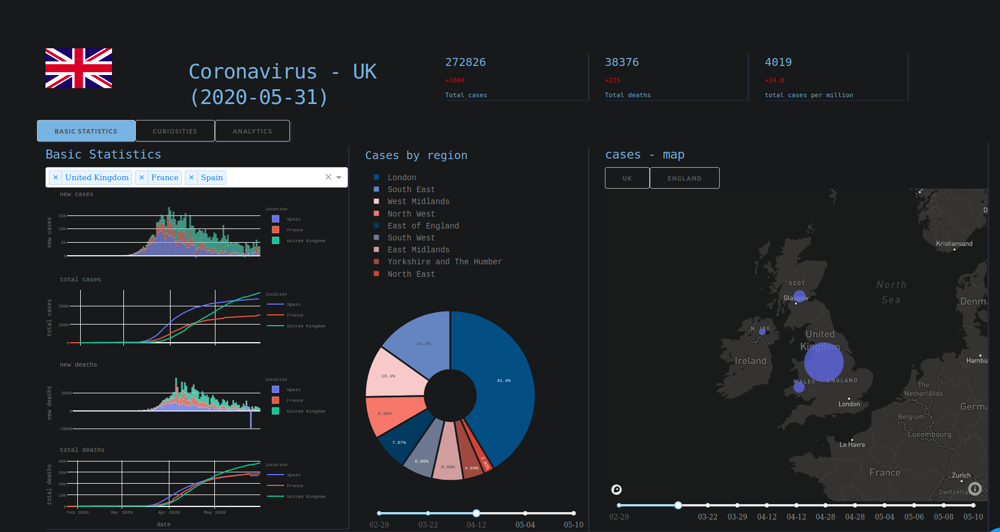
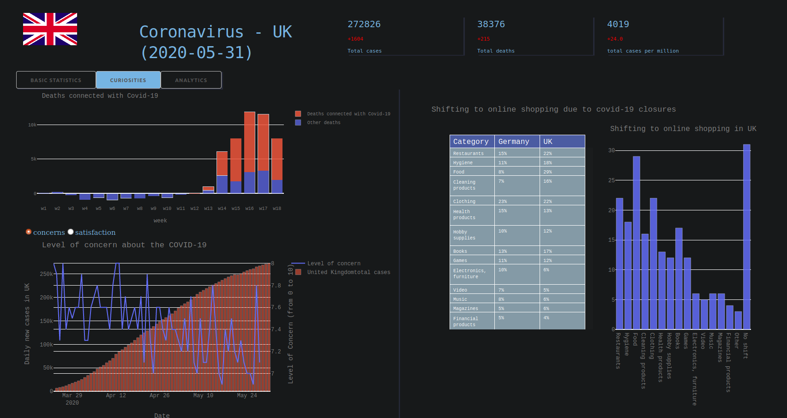
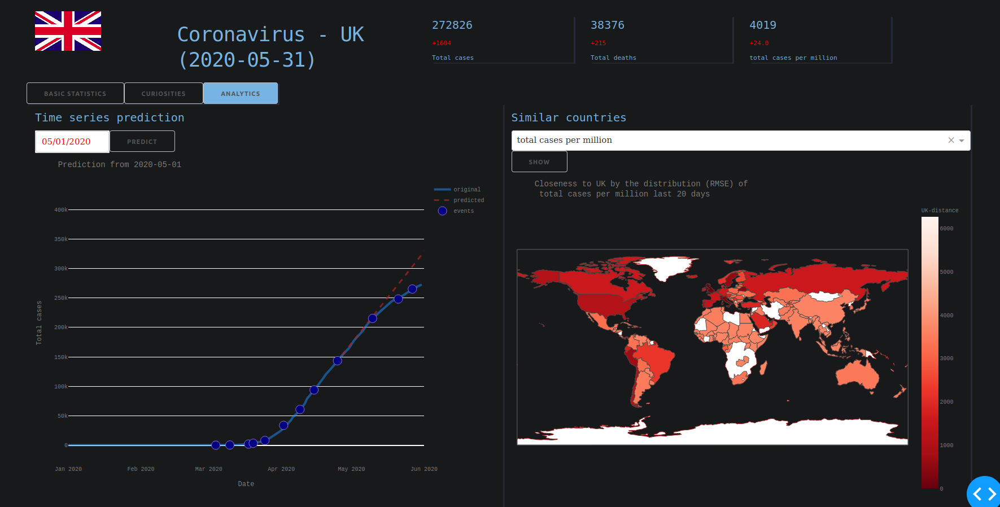

# Covid-19 in UK

Project prepared for Data analysis and visualsiation class at MiM UW 2020.
Authors: Anna Witwicka & Anna Warno
## Overview

The goal of this work was to carefully analyze covid-19 situation in UK.
The main focus of this study was not only visualisation of basics satistics but also 
trying to draw some inferences and find trends.

## Framework

As a framework we chose plotly Dash. It easily integrates with user interface and allows to perform calculations in real time.

## Data source

Most of the data was downloaded from UK Office for National Satistics (https://www.ons.gov.uk/), also global data like for example https://ourworldindata.org/coronavirus-source-data were used.

## Describtion
The analysis consists of three parts:
### Basics statistics
Plots with general statistics like total cases, total cases per milion, 
total deaths etc. are displayed. Additionaly user can choose any 
group of countries for comparision. Also the data about the location of 
covid-19 cases are included. Pie chart and two maps 
(UK and England - the most infected country) Date sliders are avaliable to visualise plots 
from past.

### Curiosities
Interesting facts form three areas: health, psychology and economy 
were chosen. Plot of differences of 2020 deaths and average from 
previous 5 years shows how true threat is Covid-19 for UK. Satisfaction 
from government and concerns compiled with pandemy growth 
allows to draw inferences about the people opinions changes.
Data about the switching to online services and comparision 
with Germany gave some information about the 
consumers behaviours in UK.

###Analytics
Two analysis were conducted. Model for total cases
 prediction basing on RMSE was prepared (Prophet). User can 
 choose a date from calendar and see the model prediction 
 from this date and original curve. Additionaly special events are provided.
 It allows to examine if some events had an impact on pandemy growth.
 The second analysis aiming in finding countries with similiar 
 accoording to specified criterion (egz. total cases per milion) 
 situation at the moment. Time series from last 20 days are extracted, 
 and smoothed by Savitzky–Golay filter 
 (https://en.wikipedia.org/wiki/Savitzky%E2%80%93Golay_filter) 
 in order to remove outliers. Then simple 
 RMSE metrics is used for calculating distances between UK time series and 
 other countries (countries with small number of cases were ommitted).
 
 
Total cases time series along 
with special dates 

## License
[MIT](https://choosealicense.com/licenses/mit/)
